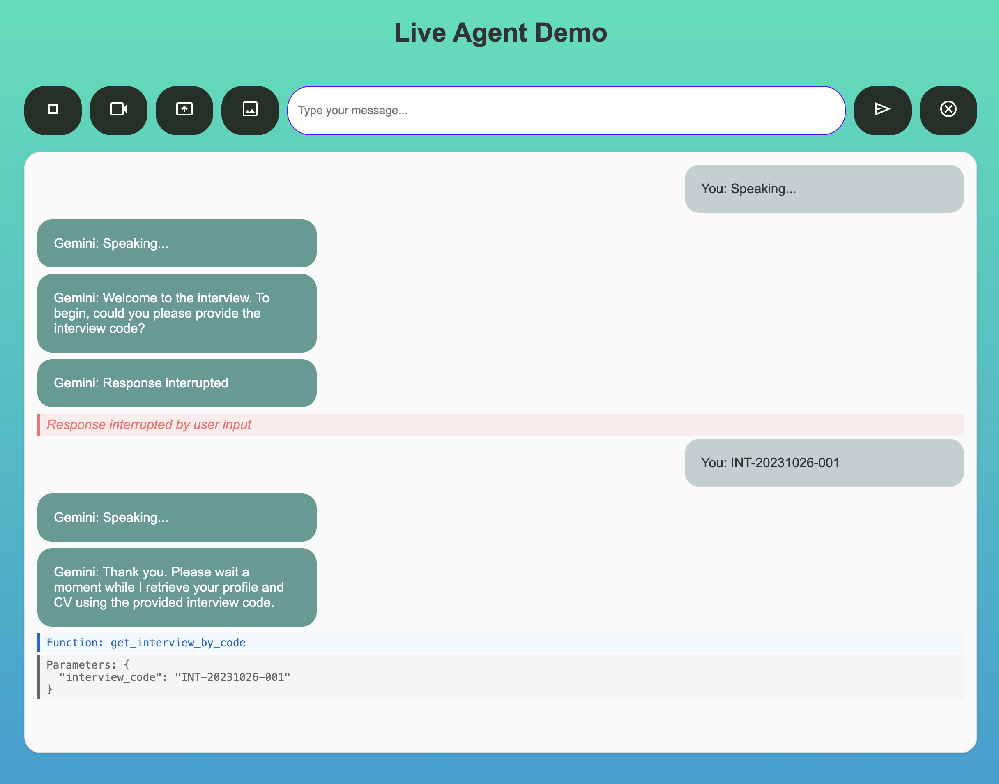

# Sample ADK Agents with Live Streaming

## Overview

This repo empowers developers to build robust, live Agents using [Google ADK](https://google.github.io/adk-docs/) that facilitate real-time multimodal interactions with end-users through audio, video, and text. 

It is an adaptation of  [Project Livewire](https://github.com/heiko-hotz/project-livewire/tree/main) created by Heiko Hotz, a modern multimodal chat solution that leverages Google's Gemini 2.0 and its Live Streaming API to enable real-time voice, text, and visual interactions.

 


The adaptation is tested for 3 sample use cases:

- `AI Interviewer`: Live AI agent that will run a personalized job interview given a job description, candidate cv, and company profile.
- `RAG`: Live AI agent that will answer questions given certain RAG data store defined in Vertex AI Search.
- `LLM Auditor`: This agent functions as an automated fact-checking layer specifically designed to evaluate and enhance the factual grounding of responses generated by Large Language Models (LLMs). It's an adaptation of this [ADK agent sample](https://github.com/google/adk-samples/tree/main/python/agents/llm-auditor)

### Key Features

- Real-time audio, video (webcam and screen sharing), and text interaction with Agent.

### Agent Development Kit Integration

- Live streaming Agent capabilities of Agent Development Kit.
- Low-latency responses with improved TTFT.
- Bidirectional streaming with interruption support.
  
## Prerequisites

- Python 3.8+
- API keys for Google Gemini API or access to Vertex AI on Google Cloud

## Installation

As first step, clone this repository.

## Configure Environment Variables

   Navigate to the server directory:
   ```bash
   cd server
   ```
   Copy the example environment file:
   ```bash
   cp .env.example .env
   ```

   Edit .env with your actual API keys and configuration:

   ```bash
   nano .env  # or use your preferred text editor
   ```

   The `.env.example` file contains required and optional environment variables. At a minimum, set the following:

   - `LOG_LEVEL`: Set your desired logging level (default: INFO)
   - `DEMO_TYPE`: Choose the demo type (hr, rag, auditor)
   - `GOOGLE_GENAI_USE_VERTEXAI`: Set to 1 to use Vertex AI, 0 to use Dev endpoint
   - `GOOGLE_API_KEY`: Your Google API key (required if using Dev endpoint)
   - `GOOGLE_CLOUD_PROJECT_ID`: Your Google Cloud project ID (required if using Vertex endpoint)
   - `GOOGLE_CLOUD_LOCATION`: Your Google Cloud region (required if using Vertex endpoint)
   - `VAIS_DATASTORE_ID [Optional]`: Required only for `RAG` agent. Your Vertex AI Search Data Store ID, see [doc here](https://cloud.google.com/generative-ai-app-builder/docs/try-enterprise-search) on how to create one.
   - `MCP_TOOLBOX_URL [Optional]`:Required only for the `AI interviewer` agent. You can leave the default value for local deployment. Dynamic value will be assiged automatically from bash scripts for remote deployment.  

## Quickstart

Choose one of the following options: Local Development or Deployment to Google Cloud Run.

### Option 1: Local Development

Follow these steps to run the application locally:

1. **Setup the Python virtual environment and install the dependencies:**

    In Cloud Shell, execute the following commands:

```bash
      python3 -m venv venv
      source venv/bin/activate
      pip install -r requirements.txt
```

2. **Start the Backend Server:**

   Make sure you're in the server *server* directory 

   Start the server:
   ```bash
   python server.py
   ```

   The backend server will start on `localhost:8081`.

3. **Create a Cloud SQL instance**

*Only for AI Interviewer Agent - Skip this step for other agent*

Create a Cloud SQL PostgreSQL instance named `live-agents-db-instance` by following [this doc](https://cloud.google.com/sql/docs/postgres/create-instance). 

4. **Create the interview table**

*Only for AI Interviewer Agent - Skip this step for other agent*

Create a table named `interview` with the below schema using the Cloud SQL Studio. Refer [to this doc](https://cloud.google.com/sql/docs/postgres/manage-data-using-studio)

```sql
CREATE TABLE "public".interview (
 interview_id SERIAL PRIMARY KEY,
 interview_code VARCHAR NOT NULL,
 interview_date DATE,
 candidate_cv JSONB,
 job_description JSONB,
 evaluation JSONB
);
```
Populate the table with random data. You can give this schema to Gemini and ask it generate `INSERT` statements.

Below is a sample SQL Insert statement:

```sql
INSERT INTO interview (interview_code, interview_date, candidate_cv, job_description)
VALUES(
  'ABC',
  CURRENT_DATE,
  '{
        "name": "Sami Sam",
        "email": "sami@example.com",
        "skills": [
            "Cloud Computing (AWS, Azure, GCP)",
            "Data Engineering (Spark, Hadoop, Kafka)",
            "Machine Learning (TensorFlow, PyTorch, Scikit-learn)",
            "AI Architecture",

        ],
        "experience": [
            {
                "title": "Senior Data and AI Architect",
                "company": "Tech Solutions Inc.",
                "years": "2018-Present",
                "description": "Designed and implemented scalable data and AI solutions for enterprise clients. Led a team of engineers in developing machine learning models and data pipelines. Provided technical leadership and guidance to clients on cloud adoption and data strategy."
            },
            {
                "title": "Data Engineer",
                "company": "Data Insights Corp.",
                "years": "2016-2018",
                "description": "Developed and maintained data pipelines for ingesting, processing, and storing large datasets. Implemented data quality checks and monitoring systems. Collaborated with data scientists to build machine learning models."
            }
        ],
        "education": [
            {
                "degree": "Master of Science in Data Science",
                "university": "University of California, Berkeley",
                "year": "2016"
            },
            {
                "degree": "Bachelor of Science in Computer Science",
                "university": "Cairo University",
                "year": "2014"
            }
        ],
        "languages": [
            "English (Native)",
            "Arabic (Native)",
            "French (Conversational)"
        ],
        "certifications": [
            "AWS Certified Solutions Architect - Professional",
            "Google Cloud Certified Professional Cloud Architect",
            "Microsoft Certified: Azure Solutions Architect Expert"
        ],
        "projects": [
            {
                "name": "Customer Churn Prediction",
                "description": "Developed a machine learning model to predict customer churn, resulting in a 15% reduction in churn rate."
            },
            {
                "name": "Sales Forecasting",
                "description": "Built a time series model to forecast sales for different product categories, improving forecast accuracy by 10%."
            }
        ]
    }',

     '{
        "location": "Riyadh, Saudi Arabia",
        "job_title": "Senior Data and AI Architect, Cloud Consulting (English, Arabic)",
        "level": "Advanced",
        "minimum_qualifications": "Bachelor''s degree or equivalent practical experience. 7 years of experience in delivery and developing customer-facing services Data and AI programs, leading engineers and aligning with business stakeholders and executive leadership. Ability to communicate in English and French fluently to support client relationship management in this region. Ability to travel 20% of the time as required.",
        "prefered_qualifications": "Experience implementing large-scale cloud or software projects in corporate environments. Knowledge in cloud architecture with experience across a range of enterprise use cases. Understanding of modern application migration and modernization approaches. Excellent organizational, problem-solving and influencing skills",
        "about_the_job": "As a Data and AI Architect, you will work with Google’s customers on critical projects to help them transform their businesses. You will provide management, consulting, and technical aptitude to customer engagements while working with client executives and key technical leaders to deploy solutions via Google’s Cloud Platform. You will provide directional data strategy across people, process and technology. You will also work with key Google partners currently servicing top accounts to manage programs, deliver consulting services, and provide technical guidance and best practice expertise. Travel will be around 30% of client engagements. Google Cloud accelerates every organization’s ability to digitally transform its business and industry. We deliver enterprise-grade solutions that leverage Google’s cutting-edge technology, and tools that help developers build more sustainably. Customers in more than 200 countries and territories turn to Google Cloud as their trusted partner to enable growth and solve their most critical business problems.",
        "responsabilities": "Work with customer technical leads, client executives, and partners to architect, manage and deliver implementations of data and AI cloud solutions, becoming a trusted advisor to decision-makers throughout the engagement. Work with internal specialists, product, and engineering teams to consolidate best practices and lessons learned into thought leadership, methodologies, and solution. Interact with sales, partners, and customer technical stakeholders to manage project scope, priorities, deliverables, risks/issues, and timelines for successful client outcomes. Propose solution architectures and manage the deployment of cloud based Data and AI solutions according to customer requirements and implementation best practices, support consultancy pre sales teams via architectural discussions and design workshops."
    }'
);
```

5. **Start the MCP Toolbox for Database server**

*Only for AI Interviewer Agent - Skip this step for other agent*

The MCP Toolbox version installed by default from this repo is for Linux amd64. You can find it in `server/mcp_toolbox`.

If you need a different version for your local machine, install MCP Toolbox for Databases by following the `Installing the server` section [in this link](https://github.com/googleapis/genai-toolbox). Select one of the releases available [on this page](https://github.com/googleapis/genai-toolbox/releases)

Update the ```mcp_toolbox/tools.yaml``` with the cloud sql instance name and table name in case you changed them from the above step. 

   Start the MCP server:
   ```bash
   python mcp_toolbox/server.py
   ```

6. **Start the Frontend Client:**

   
   Open a new terminal window and navigate to the client directory:
   ```bash
   cd client
   ```
   
   Start a simple HTTP server:
   ```bash
   python -m http.server 8000
   ```

7. **Access the Application:**

   Open your web browser and navigate to:

   - Development UI: `http://localhost:8000/index.html`


8. **Test the Connection:**

   1. Open your browser's developer tools (F12).
   2. Check the console for any connection errors.
   3. Try sending a test message through the interface.
   4. Verify that the WebSocket connection is established.

### Option 2. Deploy to Google Cloud Run

This guide assumes you have the Google Cloud SDK (gcloud CLI) installed and configured.

1. **Configure Environment Variables**

Open ```s0_build_deploy_agent.sh``` in the root folder and edit the below environment variables:

```bash
export PROJECT_ID='my_project_id'
export PROJECT_NUMBER='my_project_number'
export LOCATION='us-central1'
export AGENTS_BUCKET='my-agents-bucket'
export DB_INSTANCE_NAME='live-agents-db-instance'
export DEMO_TYPE='hr'
```

2. **Run the Bash script to deploy agent backend**

   ```bash
   sh s0_build_deploy_server.sh
   ```

3. **Create the interview table in Cloud SQL instance**

Refer to step #4 in the local deployment option. The same applies here. 

3. **Update the backend url  in the client html file**

Before yoy start the client you need to get the remote backend url from previous script. It's printed in the last step.

If needed, you can get it by running the below command:

   ```bash
   BACKEND_URL=$(gcloud run services describe live-agent-backend-${DEMO_TYPE}  --platform managed --region us-central1 --format 'value(status.url)')
   echo $BACKEND_URL
   ```

   Then you update the URL into the following file  `client/src/index.html`

   Specifically, in Line 70, if you use GeminiAPI without any specified endpoint it will use the *'ws://localhost:8081'*, otherwise it will use the specified endpoint. For example: 

   ```javascript
       const api = new GeminiAPI(); // this will use the default endpoint:'ws://localhost:8081'
       // const api = new GeminiAPI('wss://live-agent-backend-xxxx-uc.a.run.app'); // remote BACKEND_URL example
   ```

4. **Run the Bash script to deploy agent frontend**

    Deploy the front end to Cloud Run

   ```bash
   sh s0_build_deploy_client.sh
   ```

5. **Access the Application**

   After deployment is complete, Cloud Run provides a URL for each service (frontend and backend). Access the frontend URL in your browser to use the application.

   ```bash
   FRONTEND_URL=$(gcloud run services describe live-agent-ui-${DEMO_TYPE} --platform managed --region us-central1 --format 'value(status.url)')
   echo $FRONTEND_URL
   ```

#### Troubleshooting Common Startup Issues

   - **Cloud Run deployment issues:** Check Cloud Build logs for build and deployment errors.  Ensure the service account used by Cloud Run has the necessary permissions.
   - **Secret Manager access errors:**  Verify the service account has the `Secret Manager Secret Accessor` role.
   - **Connectivity issues:** Ensure your Cloud Run services allow unauthenticated access (for basic testing).


### License

This project is licensed under the MIT License.

